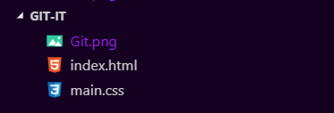
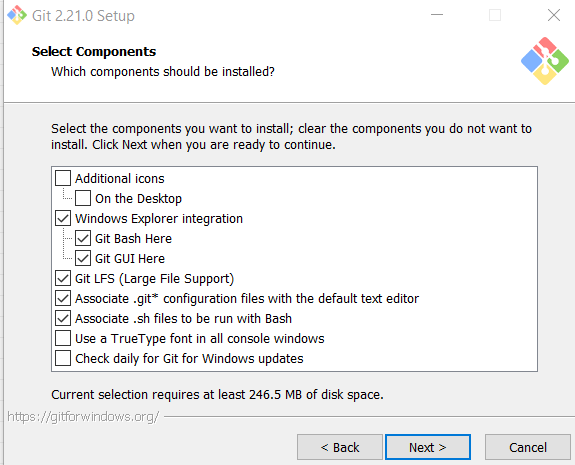
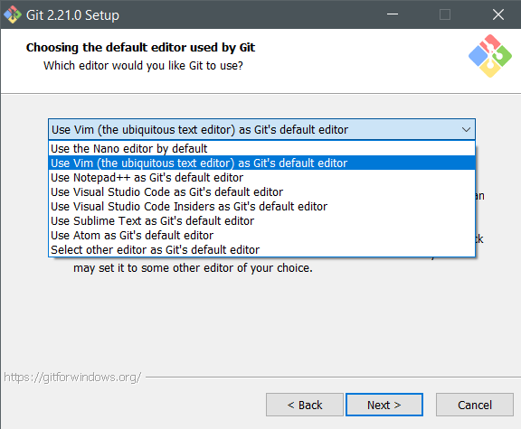

# PART 2: THE PROJECT BEGINS
In this section, we will be working on a fictional web project called **Git-It**... get it? Let's begin. 

On your system, create a folder in any location of your choice. I'd prefer you save it in your "Documents" folder for this tutorial. Name the folder "Git-It". This is the folder that will contain all the files for our project. 

##### Screenshot of my __Git-It__ folder in Documents
<pre>

</pre>
Our folder will contain the following files:

 - git.png (an image file containing the git logo). 
 - index.html (the homepage of our Git-It project).
 - main.css (a css file to style our homepage, make it look nice). 
 Create the html and css file in your folder. 
 [Download Git Logo Here](https://git-scm.com/images/logos/downloads/Git-Icon-1788C.png "Download GIT logo")
<pre>
</pre>
We will create a simple webpage, containing a header, an image, and a short paragraph. 
 

##### a screenshot of the final page...
<pre>

</pre>
And that's it, our project folder is set up - we can begin coding our project, adding lines of text to the empty files that currently sit in the folder. To implement version control in our project, let's download and install GIT.

## Installing GIT
First, go to https://git-scm.com/downloads, and click on the download link on the right. 
 <pre>
</pre>

##### Downloading GIT...
<pre>

</pre>

The download should begin once you click the 'Download' button. After it is done, double-click the file you downloaded to begin the installation. This will start a series of dialog boxes, where you will make some settings before GIT is installed. 

 

Click **Next** to begin. 

<pre>
</pre>

The next dialog box lets you select a folder on your system where you would like to install GIT. You don't need to change anything here so click next to move forward.

##### Selecting installation location 
 <pre>

</pre> 
On the next screen, you can select some components you want installed with GIT. The selected options are fine, and don't need further tweaking, except for advanced users. Click **Next** to continue.

##### Components Setup...
<pre>

</pre>

##### Code Editor...

This dialog box lets you pick the default text editor you want Git to work with. GIT is a command-line tool (more on that later), and works mostly by typing text or commands on screen. Click the drop-down to pick your preferred text editor, or click Next to leave it as default.

The next few dialog boxes contain features for advanced users. Click "Next" to go through them, until the installation begins.

##### Installation begins...
<pre>

</pre>
And that's it... well done!!! You have installed GIT on your system. High-five.

##### Installation Complete...
<pre>

</pre>

Now select the "Launch GIT bash" option, and click Finish. 

In the next class, we will talk about the command-line, and how it works with GIT. 
