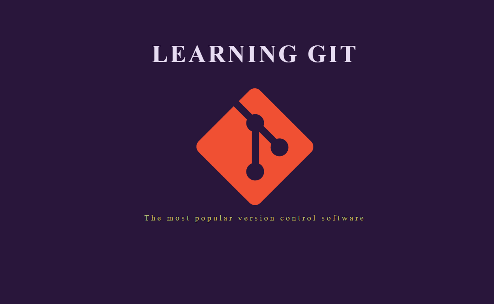

# PART 2: THE PROJECT BEGINS
In this section, we will be working on a fictional web project called **Git-It**... get it? 

Let's begin. On your system, create a folder in any location of your choice. I'd prefer you save it in your "Documents" folder for this tutorial. Name the folder "Git-It". This is the folder that will contain all the files for our project. 

##### Screenshot of my __Git-It__ folder in Documents
<pre>

</pre>
Our folder will contain the following files:

##### Git-It...
 - index.html (the homepage of our Git-It project).
 - main.css (a css file to style our homepage, make it look nice). 
 - git.png (an image file containing the git logo). 

Our webpage will be a simple one containing a header, an image, and a short paragraph.
 <pre>
</pre>

##### a screenshot of the final page...
<pre>

</pre>
In this scenario, our folder "Git-It" becomes our project folder. The project folder is where all the files will be working on will be stored. To implement version control in our project, let's download and install GIT.

## Installing GIT
First, go to https://git-scm.com/downloads, and click on the download link on the right. 
 <pre>
</pre>

##### Downloading GIT...
<pre>

</pre>

Your download should start after you click the 'Download' button. After the download is done, double-click the file you downloaded to begin the installation. This will start a series of dialog boxes, in which you make some configuration settings before GIT is installed.
 <pre>
</pre>

##### Installing GIT...
<pre>

</pre>
Click "Next" to begin. 

 <pre>
</pre>

##### Selecting installation location
<pre>

</pre>
This dialog box lets you select a folder on your system where you would like to install GIT. You don't need to change anything here so click next to move forward.

 <pre>
</pre>

##### Components Setup...
<pre>

</pre>
On this screen, you can select some components you want installed with GIT. The selected options are fine, and don't need further tweaking, except for advanced users. Click 'Next' to continue.

This dialog box lets you pick the default text editor you want Git to work with. GIT is a command-line tool (more on that later), and works mostly by typing text or commands on screen. Click the drop-down to pick your preferred text editor, or click Next to leave it as default.

The remaining dialog boxes contain features for advanced users. Click "Next" to go through them, until the installation begins.
[Screenshot 9]

And that's it... well done!!! You have installed GIT on your system. High-five.

Now select the "Launch GIT bash" option, and click Finish. 

In the next class, we will talk about the command-line, and how it works with GIT. 
