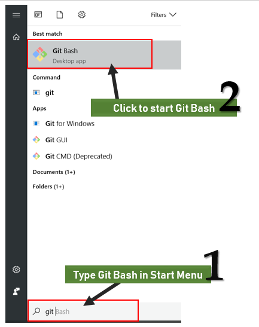

# Part 3: Git-Bash and the Command Line

In our last lesson, we created a folder for our project files, and installed GIT. We also talked about the importance of version control and collaboration when building large projects.

This section is an introduction to the command line (also known as the terminal). At the end of this section, you will will be comfortable using Git Bash, a special terminal for working with Git on Windows.

## What's the Command Line?
Modern operating systems have what we call a Graphical User Interface (GUI)... nice pretty icons and fonts that convey meaning and can respond when we 'click' or 'tap' on them. 

Years back (more like decades), computer programs weren't that fanciful. Running computer programs was mostly a text-based activity - you had to type a bunch of commands into a program called a shell/terminal/command line. This required a lot of memorization, and people who learnt these programs were considered 'professionals'. Graphical User Interface made computers more user-friendly, much easier to use.

Needless to say, most programs and software written today have a graphical interface. You can use these programs by clicking on icons and buttons, and they usually come with menus and windows for doing stuff. Microsoft Word, Photoshop and the Chrome browser are good examples.

Programs designed to run in a terminal are called command-line programs. You interact with these programs using commands. GIT is a command-line program, although some programs now offer GUI interfaces for performing GIT functions. This tutorial won't be teaching you how to use those - learning the command line will require a more intensive effort, but is ultimately more rewarding.

## Opening the Git-Bash Terminal
To start Git-Bash, perform the following actions  
 - Click the Windows or Start icon
 - In the Programs list, open the Git folder
 - Click the option for Git Bash.  
You can also type 'git bash' in the Start menu, and click to start the program.  

  
*Installation begins...*
<pre>
</pre>

If you see the screen below, we good...  

  
<pre>
</pre>

 

To understand the command line and start using it work with GIT, you should be comfortable with the following concepts...
 - A Terminal  
 This is a program in which you run other programs by typing text on the screen. The command prompt is a popular one on Windows. For this tutorial, we will be using another called Git-bash. You don't have to install git-bash - it was installed on your system when you installed GIT.

 We'll be using Git-bash as our terminal for this series. To start git-bash, do the following 
 [steps to start git-bash]

- Command-line programs[]
    knowing where you are (pwd)
    seeing others (ls) (command line and modifiers)
    looking around
    moving out
    moving up
    moving down

