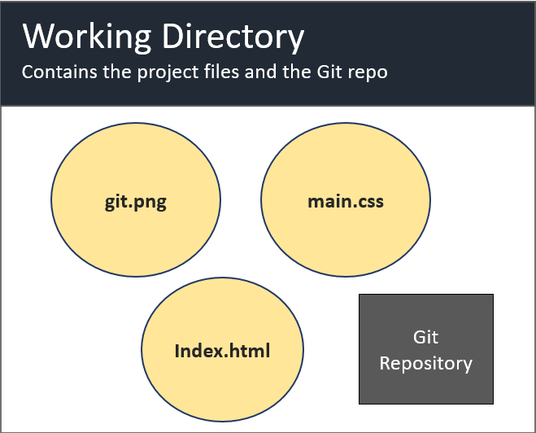

# Part 5: Commiting your work 

Last lesson, we created our first repository by initializing Git in our project folder.

In this lesson, we will explore Git some more, learning a few new commands along the way. We will start working on our project files, and learn how to save (or commit) our changes in Git. 

We will talk about the index (staging area), and end the lesson by making our first commit.

## Checking the status of your repository

Last lesson, we learnt that the command 'git init' creates a repository in our project folder.  

 

`git init` creates a hidden folder - a Git repository. This is Git's home in your working folder. From here, it will monitor the files in the directory, and store information about changes they go through as the project matures. 

Let's begin by getting some information about our repository. In the command line, type `git status`. You should get an output similar to the one below.

  

The `git status` command prints a message that will be very confusing at first; it will feel like reading Chinese. Let's go through it line-by-line. 

- The first line of the message says  
` On branch master `

We will talk about branches in more detail in a future lesson. But for now, note that all git projects begin on a branch called master.

- The second line says 
`no commits yet`

Saving changes to your project on Git is called 'commiting' the changes. This messages shows we haven't made any commits to our repository yet. When we do make our commit, this will be updated.

- Next, there's a heading  
`Untracked files: `   
Notice the three files highlighted in red? Recognize them?

When you intialize Git, you also have to tell Git what files to monitor in your project folder. Files that you ask Git to watch in your project folder are called __TRACKED FILES__.

We haven't begun tracking any files in our project. To begin tracking files in our project, we use the `git add` command.

Let's talk about this command a bit more; it is an essential tool in Git.

Imagine Git has a list. On this list, he has the names of files in your project that you have asked him to 'track'. 

This list is empty when the repository is initialized. To add files to this list, you use the 'git add' command.

Alright, less talking. Let's do an example.

In our project folder, let's tell Git to track changes to our index.html and main.css files.

Now let's check the status again.  

  

The status has been updated.
 - No commits on the repository yet.
 - There are two lines of green text below the "Changes to be committed" heading. These are the files we have 'staged' to be committed. The 'new file:' in front of the filenames indicates this is the first time we will be adding the files to the repository.
- The 'git.png' file is not being tracked. It won't be added to our commit.  

Now, time to commit our changes.

# Git Commit
A commit is a like a save point in your project. You are essentially saying "My files are this way now. They may go through some changes in the future. I want to be able to return to the way they are now."

Type `git commit -m "Commit title"` to commit your work to the repository.

Let's go through our new command.

The 'git commit' command saves our changes to the local repository - 'local' here meaning the .git folder on your system. Your files reside in your working directory, you add the files to the index, and then you make a commit to the repository. This is the basic Git workflow. Each git commit you make is essential a different version of the project... and with Git, you can go back to previous versions. That's the beauty of version control.

Every Git commit should have a message attached, that describes what the commit is about; basically, a short description of the changes you have made. This is important, as you would be working on the project with other programmers. When other programmers go through your repository, they will be able to through a list of commits made. The descriptions you enter will give them a clear idea of your contribution to the project.

Using only the 'git command' would open your text editor. This will let you type in your description before the commit is complete. This can be confusing sometimes. The -m option is a quicker command to learn.

The -m let us type in our description at the end of the command. One thing is important though - the descriptioin must be in quotation marks ("").

So, let us make our first commit.

git commit -m "My first commit"  

  

Congratulations. So far, so good. You've learnt how to use Git as version control for your project, and you made your first commit.

In our next lesson, we will be learning about remote repositories. We will talk about Github, the online code-hosting site that runs on Git. See you soon.