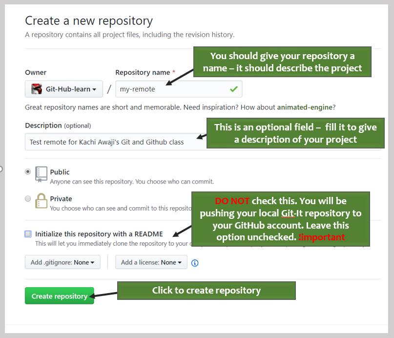

# Part 6: Github: Working with remote repositories

In the previous section, we created a local repository and made our first commits. We also learnt to use the `git commit` command to save changes to the repository, and learnt the `git log` command for viewing our repo's history.

What if you'd like to share your repository with other programmers? You can do that using __Git__ and an online service that lets you host __Git__ repositories. In this lesson, we will learn to create remote repositories using __GitHub__, an online code-hosting platform.

__Git__ is a _distributed_ VCS (version control system). This means the git repository in your project folder can be shared with others. This will let them have not just access to your files, they'd also be able to view the history of the project too(view the commits you have made). You can share your repository with others by hosting them online.

A few services that let you host repositories online include __GitHub__, __Bitbucket__, __GitLab__ and a few others. GitHub is the most popular and our focus in this series.

## Using GitHub
To host repositories on __GitHub__, create an account by visiting [their website](https://www.github.com). You should verify your account too; click on the link in an email that will be sent to you after you register.

For this series, I have created an account on __GitHub__ called Git-Hub-Learn. It will host repositories for the series which you will be working with later.

When you create a repository on your system using __Git Bash__, the repository is stored on your PC. __GitHub__ lets you create repositories that are hosted on its servers.. and you don't need the 'git init' command to create one.

## Creating a repository on GitHub
To create a repository on GitHub, in the upper-right corner of any page, click the __+__ symbol to get a drop-down. Click "New repository" to create a repository.  

  

You can choose to make the repository either public or private. Public repositories are visible to the public, while private repositories are only accessible to you, and people you share them with.

Congratulations! You've successfully created your first repository on __GitHub__. 

Next, we will link our local repo with our remote repo. This will make our local Git-Hub project accessible to others. 

## Linking your local repo to a remote repo
So, you have a __Git__ repository sitting on your system. Now you want to share your project to the world, so others can have a copy on their systems. 

Believe it or not, all you need is two commands to do so. The `git remote add` command lets you connect one local repository to a remote one. It takes two other values - a repo name(the remote repo is usually called origin), and a link to the remote repository.

The link to the remote repository is shown on GitHub. 

  

> Repo links on __GitHub__ usually follow a pattern   
 the URL to github.com : https://github.com/  
 your user name : Git-Hub-learn/  
 the repo name : my-remote.git  

so, to link our Git-Hub repo, Git bash into your project folder and type

`git remote add origin https://github.com/Git-Hub-learn/my-remote.git`

That's all. The command line doesn't print any output. To see the changes, type `git command --list`. At the bottom of the output, you should see  _remote.origin.url_ which contains a link to your remote repository.  

  

When you created your new repository, you initialized it with a README file. README files are a great place to describe your project in more detail, or add some documentation such as how to install or use your project. The contents of your README file are automatically shown on the front page of your repository.

Let's commit a change to the README file.

In your repository's list of files, click README.md.

Readme file in file list
Above the file's content, click .

On the Edit file tab, type some information about yourself.

New content in file
Above the new content, click Preview changes.

File preview button
Review the changes you made to the file. You'll see the new content in green.

File preview view
At the bottom of the page, type a short, meaningful commit message that describes the change you made to the file. You can attribute the commit to more than one author in the commit message. For more information, see "Creating a commit with multiple co-authors."

Commit message for your change
Below the commit message fields, decide whether to add your commit to the current branch or to a new branch. If your current branch is master, you should choose to create a new branch for your commit and then create a pull request.

Commit branch options
Click Propose file change.

Propose file change button
Celebrate
Congratulations! You have now created a repository, including a README file, and created your first commit on GitHub. What do you want to do next?

"Set up Git"
Create a repository
"Fork a repository"
"Be social"

