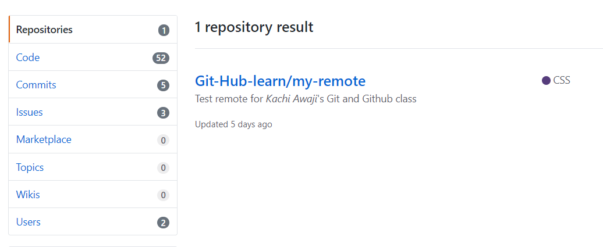
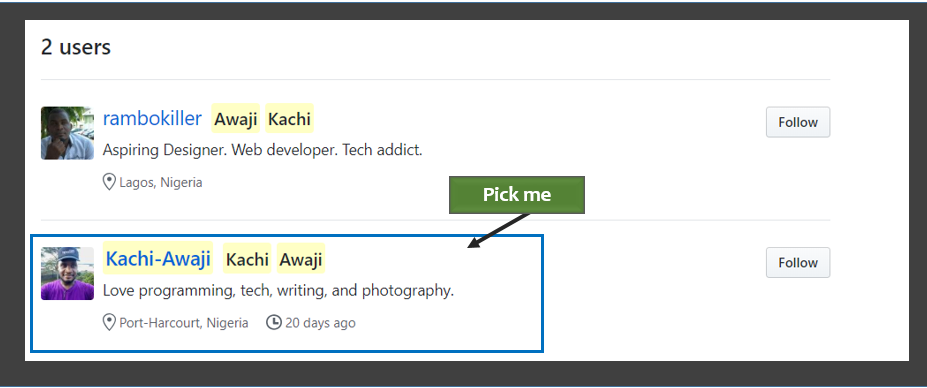

# Working with remote repositories - 2

Last lesson, you created an account on __GitHub__ and pushed a commit to your remote repository.  You are now a proud owner of a __GitHub__ account, giving you access to thousands of projects being built online. 

In this lesson, we will be taking a tour of __GitHub__, looking at the features that make it a social coding site. We will learn how collaboration works on __GitHub__, and at the end of this lesson, we will make our first contribution to a __GitHub__ project.

## Working with __GitHub__
> ### __IMPORTANT__
> The lesson notes for this series are hosted on my __GitHub__ profile. For this lesson, I have created a file called ROLLCALL.md. 
>
>The screenshots you will be seeing will be from _Git-Hub-Learn_, a __GitHub__ profile I created for this series. 
>
>It will, hopefully, mimic the screens while you make your contribution later. 
>
>This lesson will be a long one - there is so much to learn. Take your time, and don't rush it. A little patience will go a long way.

Sign in to GITHUBHOMEPAGE. You should see a screen with a dark menu bar at the top. On the left, just beside the GitHub logo is a search field you can use to find other __GitHub__ users, repositories, commits, etc. 
> Tip: You can hit forward-slash(/) on your keyboard to access the search field.

Beside the search field are links to let you access pull requests, issues, and the marketplace. We will look at this later on. Clicking _Explore_ will let you view popular repositories on __GitHub__.

  

On the right side of the menu, the notification icon is similar to facebook's. You will be notified if another user follows you, sends you a pull request, etc. Beside is a drop-down menu that lets you do stuff like create new repositories, gists and much more.  You can access your profile settings by clicking your profile picture on the far-right.

You will get more familiar with the menu as your contributions on __GitHub__ grows. Below the menu, the screen is broken into three parts. 

[Below the menu screenshot]
	
On the left side, a list of the repositories on your account is displayed. In the middle, you will see updates from other users or projects you might be following. On the right side are links to other repositories you might be interested in... think 'repo suggestions'... 

## Finding other users
The Search find is how you find a host of things on __GitHub__. Enter "Kachi Awaji" to find me (😊) on __GitHub__. 

  

The search results are divided into various categories: repositories, code, commits, issues, marketplace, wikis, and users.

You are looking for a user, so click on _Users_ at the bootom of the list.

  

In the next section, we are going to learn how to find another user on __GitHub__. You can view their profile to get to know about them, and also see a list of their public repositories. Private repositories are usually by professionals who may not want their projects' codes to be viewed publicly.

You will learn how to make copies of their repositories using the "git clone" command. You  

Below the menu, the screen is divided into three sections.

## Downloading Repos from GitHub
You can create a repository in one of two ways  
1. Create one locally using `git init`.
2. Get one online (remote repository).

You are already familiar with the first step. Now, let's get a remote repository from "Git-Hub-learn"'s profile on __GitHub__.

<!-- #
The remote repository takes the most recent commit, and uses that to create the files on the server. 

When you created your new repository, you initialized it with a README file. README files are a great place to describe your project in more detail, or add some documentation such as how to install or use your project. The contents of your README file are automatically shown on the front page of your repository.

Let's commit a change to the README file.

In your repository's list of files, click README.md.

Readme file in file list
Above the file's content, click .

On the Edit file tab, type some information about yourself.

New content in file
Above the new content, click Preview changes.

File preview button
Review the changes you made to the file. You'll see the new content in green.

File preview view
At the bottom of the page, type a short, meaningful commit message that describes the change you made to the file. You can attribute the commit to more than one author in the commit message. For more information, see "Creating a commit with multiple co-authors."

Commit message for your change
Below the commit message fields, decide whether to add your commit to the current branch or to a new branch. If your current branch is master, you should choose to create a new branch for your commit and then create a pull request.

Commit branch options
Click Propose file change.

Propose file change button
Celebrate
Congratulations! You have now created a repository, including a README file, and created your first commit on GitHub. What do you want to do next?

"Set up Git"
Create a repository
"Fork a repository"
"Be social"

 -->
