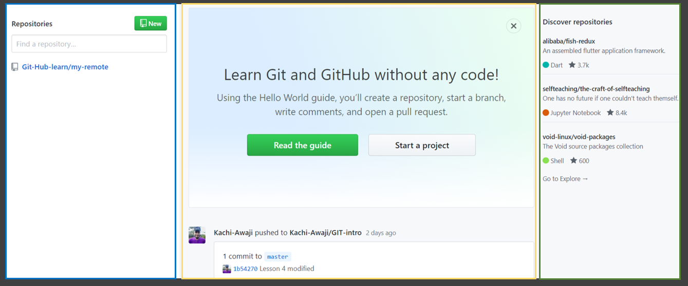
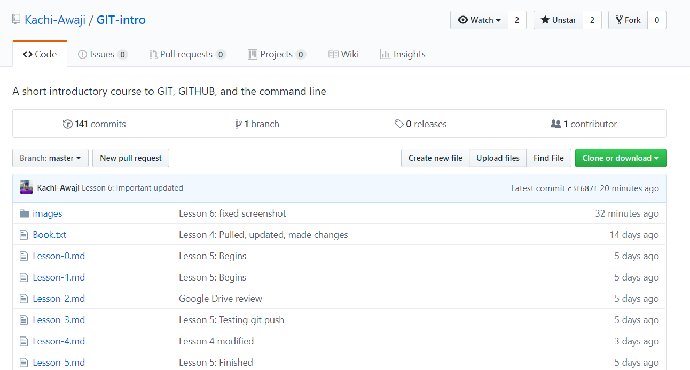
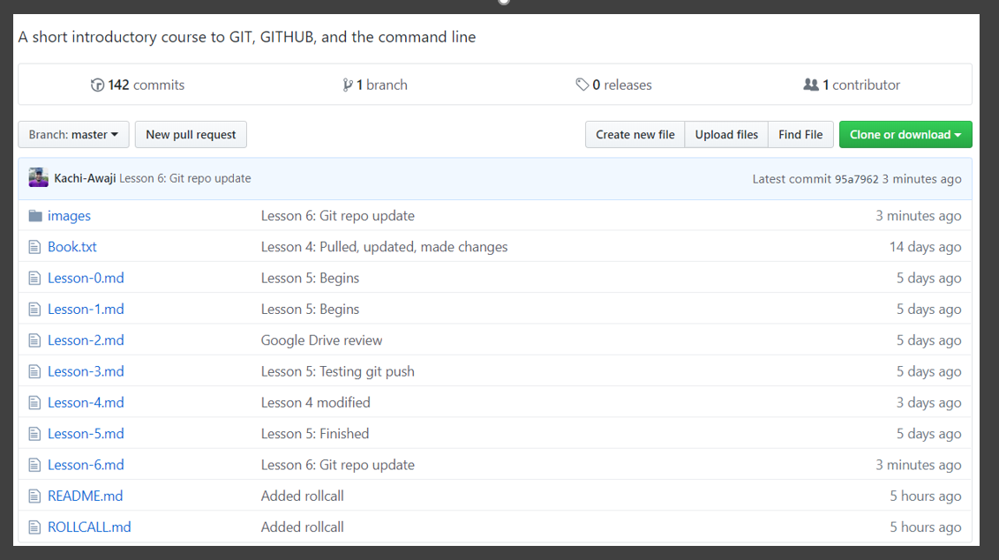
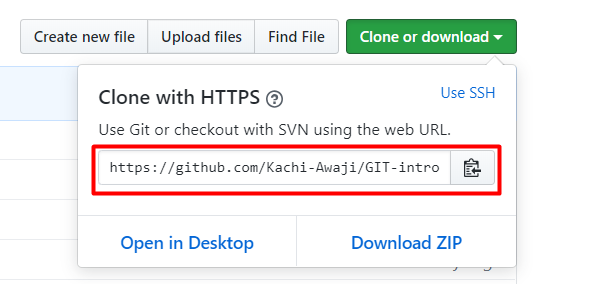

# Working with remote repositories - 2

Last lesson, you created an account on __GitHub__ and pushed a commit to your remote repository.  You are now a proud owner of a __GitHub__ account, giving you access to thousands of projects being built online. 

In this lesson, we will be taking a tour of __GitHub__, looking at the features that make it a social coding site. We will learn how collaboration works on __GitHub__, and at the end of this lesson, we will make our first contribution to a __GitHub__ project.

## Working with __GitHub__
> ### __IMPORTANT__
> The lesson notes for this series are hosted on my __GitHub__ profile on a repo (_Git-Intro_).  
For this lesson, I have created a file called ROLLCALL.md on this repository for you to make a contribution later on. 

Sign in to [__GitHub__](https://github.com)  . You should see a screen with a dark menu bar at the top. On the left, just beside the GitHub logo is a search field you can use to find other __GitHub__ users, repositories, commits, etc. 
> Tip: You can hit forward-slash(/) on your keyboard to access the search field.

Beside the search field are links to let you access pull requests, issues, and the marketplace. We will look at these later on. Clicking _Explore_ will let you view popular repositories on __GitHub__.

  

On the right side, there's a notification icon (it looks like a bell) where you can check notifications. You will get a notification if another user follows you, sends you a pull request, etc. 

  

To its right is a __+__ symbol that produces a drop-down menu when clicked. It lets you do stuff like create new repositories, gists and much more.  

Your profile picture is displayed beside the __+__ symbol. Click it to access a menu that lets you configure profile and account settings.

You will get more familiar with the menu as your contributions on __GitHub__ grows. Below the top menu, the screen is broken into three sections. 

 

A list of the repositories on your account is displayed on the left side. In the middle, you will see updates from other users or projects you might be following. It will also display your activities on __GitHub__ - your contributions, commits, and related information. The right side is the "Discover" section - it displays repositories you might be interested in... think 'repo suggestions'... 

## Finding other users
The Search field is how you find a host of things on __GitHub__. Enter "Kachi Awaji" to find me 😊 on __GitHub__. 

  

The search results are divided into various categories: repositories, code, commits, issues, marketplace, wikis, and users. You are looking for a user, so scroll down and click on _Users_ to show users that fit the search entry. This will show you two results.

  

The first account is an account I created when learning __Git__. I don't use it much these days, but there are a few repositories on there you might find helpful.

The second is my main account. Click the __profile picture__ or __user name__ to view my [__profile__](https://github.com/Kachi-Awaji).

Links to popular repositories on my profile are shown on the right. 
You can also click the _Repositories_ tab on the right of my profile picture to view all repositories on my profile. 

You will be making a contribution to the __Git-Intro__ repository. Click on the repository to view the files it contains. 

The repository's identity is displayed at the top - a combination of the username and the repository name. You can always take a quick look at this if you get lost when going through __GitHub__ repositories.

On the right are three buttons that let you interact with the repository:
- Click on _Watch_ if you want to be notified of changes to this repository. 
- If you really love a repository, click _Star_ to make it easy to find it again later. You can see all the repositories you have starred by going to your stars page. (find your star page by going to your profile and clicking on the _stars_ tab on the right).
- The _Fork_ button lets you make a copy of the repository on your profile. We will talk more on this soon.

Just below are six tabs : _Code_, _Issues_, _Pull request_, _Projects_, _Wiki_ and _Settings_. 

The _Code_ tab is open by default and displays the contents of the repository below. 

There's a brief description of the repository, and below it a few stats (number of commits on the repository, branches, releases, and contributors)

Below are two buttons. The one on the left lets you select a branch to work on. The other is for making pull requests. You will learn about these soon.

On the other side are three buttons that let you create a new file, upload a file to the repository, or find a file on the repository.  The green button at the end lets you clone or download the repository.

## Cloning a repository
You can create a repository on your system, or download one from the internet. __GitHub__ is a great site to find repositories to download. For each repository hosted on your __GitHub__ account, __GitHub__ provides a link for which you can access it. Click the  green __Clone or Download__ button to reveal the link.

The highlighted link is important if you want a copy of the repository on your system. Cloning a repository downloads the repository to your system, letting you have access to files in the project. The rest of this section will take place in the command line.

To clone a repository, _git bash_ into any folder on your system. For this example, I am using the "Documents" folder on my system. 

On the command line, type `git clone repolink`.

[clone screenshot]

If the command is successful, you should have a new folder in your working directory called "GIT-intro". Type "ls" to confirm. 

The `git clone` command does three things:
- creates a folder(this folder is same as the repository's name by default)
- downloads the repository(.git folder) living on the remote address you provided.
- from the repository, it 'checkouts' the most recent commit. This will reproduce the working directory as it was when it was last saved. All the files that were in the project folder are created. 

You can now make changes to the project file. But, you wouldn't be able to push those changes to the server - the changes you make will only be on your local copy of the repository. Remember, the remote repository resides on my GitHub account, not yours. You will need my account credentials to push changes directly to this repository. We will learn how to push changes to the remote repository in a later section.

As I add more lesson files to the project, it will go through new commits. You can make sure your repository is up to date with mine by using the `git pull` command. This will pull in new changes from my repository into yours, updating the files in your project directory.

## Back to GitHub
Let's go back to our repository on __GitHub__. If you do not have __Git__ installed on your system, the 'download as zip' option saves the project files in a zip folder for download.  

Next, just before the list of files and folders and repos are displayed, details about the latest commits to the repository are displayed. You can tell from the profile picture displayed that I made the last commit on the repository, and the commit message is displayed beside my picture.

Our project files and folders are displayed below. The images folder contains all the screenshots used in this tutorial. The repo also contains the lesson files, a Readme.md file, and a Rollcall.md.

Files with .md extensions indicate that they are written in Markdown. Markdown is markup language for quickly formatting documents published on the web. 

There's a README file whose content is displayed automaticaly below your repository by __GitHub__. Use a README file to give users a bit of information about your repository. 

## Forking a repository

<!-- #
The remote repository takes the most recent commit, and uses that to create the files on the server. 

When you created your new repository, you initialized it with a README file. README files are a great place to describe your project in more detail, or add some documentation such as how to install or use your project. The contents of your README file are automatically shown on the front page of your repository.

Let's commit a change to the README file.

In your repository's list of files, click README.md.

Readme file in file list
Above the file's content, click .

On the Edit file tab, type some information about yourself.

New content in file
Above the new content, click Preview changes.

File preview button
Review the changes you made to the file. You'll see the new content in green.

File preview view
At the bottom of the page, type a short, meaningful commit message that describes the change you made to the file. You can attribute the commit to more than one author in the commit message. For more information, see "Creating a commit with multiple co-authors."

Commit message for your change
Below the commit message fields, decide whether to add your commit to the current branch or to a new branch. If your current branch is master, you should choose to create a new branch for your commit and then create a pull request.

Commit branch options
Click Propose file change.

Propose file change button
Celebrate
Congratulations! You have now created a repository, including a README file, and created your first commit on GitHub. What do you want to do next?

"Set up Git"
Create a repository
"Fork a repository"
"Be social"

 -->
